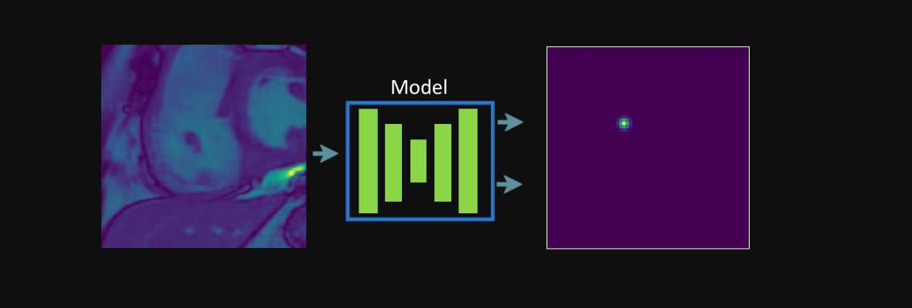
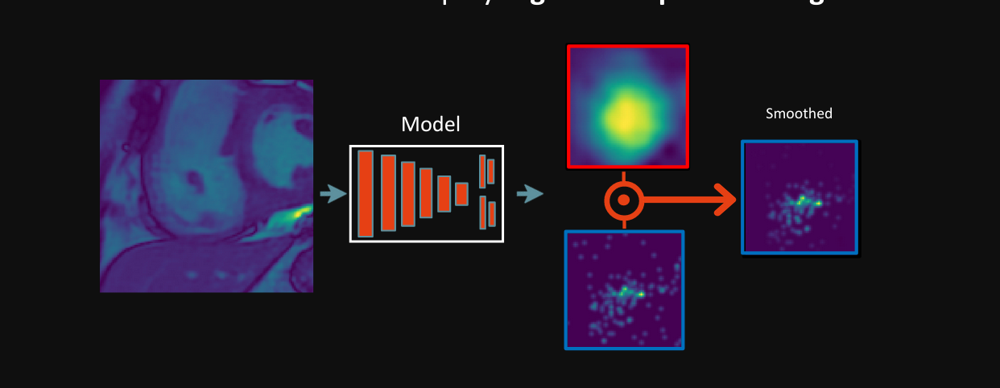
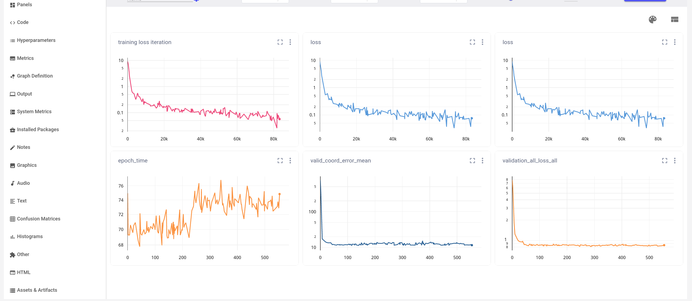
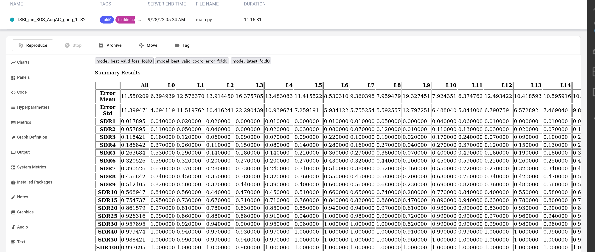

# LaNNU-Net

LannU-Net is an out-of-the-box automated pipeline for landmark localization. It is inspired by [nnU-Net](https://github.com/MIC-DKFZ/nnUNet), but tailored for landmark localization rather than biomedical image segmentation. We also support uncertainty estimation for model predictions.

As a user, all you need to do is provide your data in the correct format following simple instructions and the pipeline will take care of the rest.

The pipeline is simple, and based on the [U-Net architecture](https://link.springer.com/content/pdf/10.1007/978-3-319-24574-4_28.pdf). It automatically configures the size of the architecture based on the size of your images. By default, we use heatmap regression for landmark localization. We support ensemble learning, and uncertainty estimation.

As a researcher/developer, you can extend this framework to add your own models, loss functions, training schemes etc. by extending a few classes. The advantage of this is that there is a *lot* of code you don't have to write that is specific to landmark localization and you can concentrate on implementing the important stuff. 

I provide easy instructions with examples on exactly what you need to do. You can use this framework to evaluate your own models over many datasets in a controlled environment.  So far, beyond U-Net we have also added PHD-Net, which is a completely different paradigm of landmark localization, but can be integrated seamlessly with this framework.


For advanced users, we provide the following features:
- Support for new architectures by extending a few classes.
- Extensive, easy configuration using .yaml files.
- Data augmentation strength.
- Regress Sigma for Gaussian Heatmap (Beta).
- Patch-based sampling (Beta).
- Ensembling.
- Uncertainty Estimation.
- Comet.ML logging


# Table of Contents
- [LaNNU-Net](#lannu-net)
- [Table of Contents](#table-of-contents)
- [Installation](#installation)
- [Running an Example](#running-an-example)
  - [Inference (Testing)](#inference-testing)
- [Using Your Own Dataset](#using-your-own-dataset)
  - [1) Expected Directory Format](#1-expected-directory-format)
  - [2) Create a JSON file](#2-create-a-json-file)
  - [3) Create a .yaml config file](#3-create-a-yaml-config-file)
- [Train your model!](#train-your-model)
  - [Training](#training)
  - [Inference (Testing)](#inference-testing-1)
- [Implemented Models (U-Net \& PHD-Net)](#implemented-models-u-net--phd-net)
  - [U-Net](#u-net)
  - [PHD-Net](#phd-net)
- [Advanced Configuration](#advanced-configuration)
  - [Advanced Dataset Configuration](#advanced-dataset-configuration)
  - [Changing the .yaml Config File](#changing-the-yaml-config-file)
    - [DATASET](#dataset)
    - [SAMPLER](#sampler)
      - [SAMPLER.PATCH](#samplerpatch)
    - [SOLVER](#solver)
    - [TRAINER](#trainer)
    - [MODEL](#model)
      - [MODEL.UNET](#modelunet)
      - [MODEL.PHD-NET](#modelphd-net)
      - [INFERENCE](#inference)
      - [OUTPUT](#output)
- [Advanced Features](#advanced-features)
  - [Ensembling and Uncertainty](#ensembling-and-uncertainty)
  - [Adding Your Own Model Architecture and Task](#adding-your-own-model-architecture-and-task)
    - [The Model Class](#the-model-class)
    - [The Model Trainer Class](#the-model-trainer-class)
    - [The Label Generator Class](#the-label-generator-class)
  - [Changing the Loss Function](#changing-the-loss-function)
  - [Changing Training Schedule](#changing-training-schedule)
  - [Data Augmentation](#data-augmentation)
  - [Full Image vs. Patch-based Training](#full-image-vs-patch-based-training)
    - [Full Image (Default)](#full-image-default)
    - [Patch-Based](#patch-based)
  - [Sigma Regression](#sigma-regression)
  - [Logging](#logging)
    - [How to Use Comet.ml](#how-to-use-cometml)
  - [Inference: Fitting a Gaussian to the Predicted Heatmap](#inference-fitting-a-gaussian-to-the-predicted-heatmap)
  - [Debugging](#debugging)

# Installation
1) Clone the repo
2) cd into the repo
3) Create and activate conda environment
```
conda create --name my_env
conda activate my_env
```
3) Install from the environments .yaml file
```
conda env update --name my_env --file requirements/environment.yml
```

That's it!

# Running an Example
If you have a config .yaml file and data accessible, you can run the following command to train a model:
    
    python main.py --cfg /configs/some_config.yaml

For students at the University of Sheffield using the Bessemer on the HPC, you have to load conda and CUDA. I have written a script to do this and then run the command above. Run the following:
```
    cd scripts/scripts_bess
    source run_train_config.sh --cfg ../../configs/some_config.yaml
```
## Inference (Testing) 
If you included a *testing* list in your JSON, inference will be completed after training and the results will be saved in the OUTPUT.OUTPUT_DIR.

 If you did not include a *testing* list, you can run inference on a separate json file by:
1) Setting TRAINER.INFERENCE_ONLY= True. 
2) Setting DATASET.SRC_TARGETS to the path of the new JSON file with the *testing* list.
3) Setting TRAINER.FOLD to -1 (remember, if it is not -1 it will automatically try to find the fold0.json, fold1.json etc. files from the SRC_TARGETS folder). 
# Using Your Own Dataset
As a user, all you need to do is provide your data in the correct format, fill in a config file, and LannU-Net will take care of the rest. 


## 1) Expected Directory Format
Currently, we support dicom, npz and png image formats. However, all images in one dataset should have the same format. The expected directory format is as follows:

    root_image_folder
        ↳ aribitary_subroute_1
            ↳ image_1.png
            ↳ image_2.png
            ↳ ...
        ↳ aribitary_subroute_21
            ↳ aribitary_subroute_22
                ↳ image_3.png
            ↳ aribitary_subroute_23
                ↳ image_4.png
        ↳ image_5.png
        ↳ ...


Essentially, the exact directory format does not matter, as long as all images have a common root folder (root_image_folder). However, for simplicity I recommend keeping the directories consistent since it will make the JSON generation easier. In the JSON file, you need to specify the route from the root_image_folder to each sample's image.


## 2) Create a JSON file
The JSON file contains all the dataset information LannU-Net needs for the training, validation and (optionally) testing of the dataset.

The *minimum* JSON file should include the name of the dataset, a short description, a fold number, and a training, validation & (optionally) testing lists. The 3 lists include the individual samples of the dataset, where each sample is a dictionary. Samples in the *training* list will be used for training, *validation* for validation and *testing* for testing.

    {
        "name": "EXAMPLE DATASET NAME",
        "description": "Cardiac MRI 4ch View Images.",
        "fold": 0,
        "training": [],
        "validation": [],
        "testing": []
    }


Here is an example of a dataset JSON file. The *training* list shows the minimum information needed per sample: a unique id, a 2D list of coordinates (landmarks), and the path to the image. The *validation* and *testing* lists should follow the same format. The image path ("image") should connect the root_image_folder from above in subsection *1) Expected Directory Format* to the sample's image. If you want to add more attributes to each sample see [[Advanced JSON format]].


    
    {
        "name": "ASPIRE BASELINE + FOLLOWUP",
        "description": "Cardiac MRI 4ch View Images.",
        "fold": 0,
        "training": 
            [
                {
                    "id": "PHD_430",
                    "coordinates": 
                        [
                            [320.0, 316.0], 
                            [228.0, 339.0],
                            [259.0, 220.0], 
                            [340.0, 220.0],    
                        ],
                    "image": "PAH-Baseline/Proc/4ch/PHD_430/phase_1.npz",             
                },
                {
                    "id": "PHD_431",
                    "coordinates": 
                        [
                            [320.0, 316.0], 
                            [227.0, 329.0],
                            [239.0, 220.0], 
                            [360.0, 210.0],    
                        ],
                    "image": "PAH-Baseline/Proc/4ch/PHD_431/phase_1.npz",               
                }
            ],
        "validation": 
            [
                . . .
            ],
        "testing": 
            [
                . . .
            ]
    }

If your testing set has no annotations, set the coordinates of each sample to null and add an has_annotation bool and set it to false:

    "testing": 
        [
            {
                "id": "1.2.840.113619.2.312.2807.4259692.12440.1659507727.690",
                "image": "PAH-Large/4ch 3/155276/7/DICOM/MR000000.dcm",
                "has_annotation": false,
                "coordinates": null,
            },
            {
                "id": "1.3.1.45.43.34621389534287095312.23",
                "image": "PAH-Large/4ch 3/23512/7/DICOM/14.dcm",
                "has_annotation": false,
                "coordinates": null,
            }
        ]   

<!-- &#8627; -->

If you are performing cross-validation (CV), make a JSON file for each fold and **you MUST set the name of each file to fold0.json, fold1.json, etc.** These files should be in the same root folder. If you are not using CV, it does not matter what the name is. Folder Structure example:

    root_annotation_folder
        ↳ fold0.json
        ↳ fold1.json
        ↳ fold2.json
        ↳ fold3.json
        ↳ fold4.json

## 3) Create a .yaml config file
Now your dataset is in the correct directory structure and you have the JSON annotation files, you just need to edit it a yaml based config file and you're ready to go! We will override the default config parameters in the config.py file. Under the /configs/ directory, create a yaml file e.g. my_dataset_config.yaml and fill in the following options:


    OUTPUT:
        OUTPUT_DIR: "/path_to_output_folder/results"

    SOLVER:
        DATA_LOADER_BATCH_SIZE: 32

    DATASET:
        ROOT: '/path_to_image_root/root_image_folder'
        SRC_TARGETS: '/path_to_annotation_root/root_annotation_folder/no_cv_annotations.json'
        LANDMARKS : [0,1,2,3,]
    
    TRAINER:
        INFERENCE_ONLY: False
        CACHE_DATA: False
        FOLD: -1 #no cv

    SAMPLER:
        INPUT_SIZE : [512,512]


- OUTPUT.OUTPUT_DIR: The path to the folder where the model checkpoints and results will be saved. 
- DATASET_ROOT.ROOT: The path to the root_image_folder from above in subsection *1) Expected Directory Format*.
- DATASET.SRC_TARGETS: The path to the root_annotation_folder from above in subsection *2) Create a JSON file*. If you are not using CV, specify the exact JSON file like in the example above. If you are using CV, just specify the root_annotation_folder and the TRAINER.FOLD information will be used to select the correct JSON file.
- DATASET.LANDMARKS: The indices of the landmarks in the JSON file. For example, if the JSON file has 4 landmarks, and you want to use the first 3, then the list should be [0,1,2].
- TRAINER.FOLD: The fold number to use for training. This number will match the number in fold0.json, fold1.json etc. **If you are using cross-validation, set this to -1**.
- TRAINER.CACHE_DATA: If you are using a small dataset, it is recommended to set this to True. This will cache the dataset in memory, which will speed up training. However, if you are using a large dataset, you may run out of memory. *Try as True first.*
- TRAINER.INFERENCE_ONLY: If you want to train first, set this to False. If you have already trained a model and want to run inference on a new dataset, set this to True.
- SOLVER.DATA_LOADER_BATCH_SIZE: The batch size to use for training. This should be set to the largest batch size your GPU can handle. First, try high and go smaller if you run out of memory. This will be automated in future.
- SAMPLER.INPUT_SIZE: The size you want to resize the images to for training. Regardless of resolution uniformity in the dataset, you need to resize them to a common size. If possible, use the median size of the dataset. If the median resolution is too big to fit into memory, [512, 512] is a good bet. Alternatively you can use full-resolution images via patch-based training, explained in [[Patch-based Training]]. This will be automated in future.

There are many other options you can set in the config file such as data augmentation scheme, learning schedule, architecture choice & parameters, loss function, sigma regression etc. See [[Config File]] for more information.


# Train your model!

## Training 
You are now ready to train your landmark localization model! From /LannU-Net/ run:
    
    python main.py --cfg /configs/my_dataset_config.yaml

For students at the University of Sheffield using the Bessemer on the HPC, you have to load conda and CUDA. I have written a script to do this and then run the command above. Run the following:
```
    cd scripts/scripts_bess
    source run_train_config.sh --cfg ../../configs/my_dataset_config.yaml
```
## Inference (Testing) 
If you included a *testing* list in your JSON, inference will be completed after training and the results will be saved in the OUTPUT.OUTPUT_DIR.

 If you did not include a *testing* list, you can run inference on a separate json file by:
1) Setting TRAINER.INFERENCE_ONLY= True. 
2) Setting DATASET.SRC_TARGETS to the path of the new JSON file with the *testing* list.
3) Setting TRAINER.FOLD to -1 (remember, if it is not -1 it will automatically try to find the fold0.json, fold1.json etc. files from the SRC_TARGETS folder). 

For example:


    TRAINER:
        INFERENCE_ONLY: True
        FOLD: -1 #no cv

    DATASET:
        SRC_TARGETS: '/path_to_annotation_root/root_annotation_folder/testing_only.json

        


If you want to perform inference on a specific model checkpoint, also add the following to the yaml file:


    MODEL:
        CHECKPOINT: '/path_to_checkpoint/your_model_checkpoint.model'

*If you omit MODEL.CHECKPOINT or set MODEL.CHECKPOINT=None, LannU-Net will perform inference over all model checkpoints in the OUTPUT.OUTPUT_DIR directory.*

If you did include a *testing* list in your JSON, and simply want to re-run the inference, you can solely perform inference by leaving the yaml file the same and just changing TRAINER.INFERENCE_ONLY = True. You can also pick and choose which model checkpoint to perform inference on too. 

Note, here you are *editing* the yaml config file from training, not creating one with only these fields. Alternatively, you can copy the training yaml and have two separate yaml files: one for training, one for testing. Just remember to add the correct one to the command line as the cfg parameter when running the programme.

Now, Run the same command as above.

    python main.py --cfg /configs/my_dataset_config.yaml

# Implemented Models (U-Net & PHD-Net)

## U-Net
U-Net follows the encoder-decoder architecture, originally proposed by Ronneberger et al , [here](https://arxiv.org/abs/1505.04597).    

It learns an image-to-image translation between the input image and a heatmap centered on the landmark of interest.



## PHD-Net 
PHD-Net as described by Schobs et al, [here](https://ieeexplore.ieee.org/document/9433895). It is a patch-based multi-task learning model that learns to localize landmarks through a heatmap regression and a displacement regression task.


# Advanced Configuration

## Advanced Dataset Configuration
If you want to add extra attributes associated with each sample e.g. a patient ID, a year of the scan etc, you can. Then, during inference you can save this info alongside the prediction for each patient. 

First, when you generate your JSON file, simply add an additional key in each sample's dictionary. See the example below where we add the attributes "extra_info".

    {
        "name": "ASPIRE BASELINE + FOLLOWUP",
        "description": "Cardiac MRI 4ch View Images.",
        "fold": 0,
        "testing": 
            [
                {
                    "id": "PHD_430",
                    "coordinates": 
                        [
                            [320.0, 316.0], 
                            [228.0, 339.0],
                            [259.0, 220.0], 
                            [340.0, 220.0],    
                        ],
                    "image": "PAH-Baseline/Proc/4ch/PHD_430/phase_1.npz",      
                    "extra_info": 123       
                },
                {
                    "id": "PHD_431",
                    "coordinates": 
                        [
                            [320.0, 316.0], 
                            [227.0, 329.0],
                            [239.0, 220.0], 
                            [360.0, 210.0],    
                        ],
                    "image": "PAH-Baseline/Proc/4ch/PHD_431/phase_1.npz",     
                    "extra_info": 124   
          
                }
            ],
       
    }

Then, extend [dataset_base.py](./datasets/dataset_base.py) and define a list called additional_sample_attribute_keys with the keys you want to save in the output csv files. Pass these through to super.\__init__ function.See [dataset_aspire.py](./datasets/dataset_aspire.py)  of an example of how to do this. In that example we wanted to save the suid of the CMRI along with the patient ID in the output csv file so the doctor's could match the patient and scan to their database.

Make sure you set the DATASET.DATASET_CLASS to the name of your new dataset class in the yaml file and add the key to [dataset_index.py](./datasets/dataset_index.py).


## Changing the .yaml Config File
There are many other options you can configure in the .yaml config file. All default options can be found in the [default config file](config.py). Simply override these configurations in your own config file, as you did when [creating your .yaml config file](#creating-a-yaml-config-file). You can change the following options:

The list is quite overwhelming, but the key ones to get started are explained in [Create A yaml Config File](#3-create-a-yaml-config-file).


### DATASET
Parameters concerning dataset details and dataset paths.
- **DATASET_CLASS** (str): The name of the dataset class to use. The  class must be implemented following my instructions [here](#advanced-dataset-configuration).
    
     *Default:* "generic" - This should be good for the average user.

- **ROOT** (str): The path to the root image folder. Organized as described [here](#expected-directory-format).
    
     *Default:* '''

- **Name** (str): The name of the dataset.
    
     *Default:* '''

- **SRC_TARGETS** (str): The path to either the JSON annotation root folder (when using CV), or exact JSON annotation file (when not using CV), as described [here](#2-create-a-json-file).
    
     *Default:* '''
    
- **IMAGE_MODALITY** (str): The modality of the images e.g. CMRI, Cephalometric, CT etc.
    
     *Default:* 'CMRI'

- **LANDMARKS** (str): The indices of the landmarks in the JSON file. For example, if the JSON file has 4 landmarks, and you want to use the first 3, then the list should be [0,1,2].
    
     *Default:* [ ]


- **TRAINSET_SIZE** (int): The number of samples to use from your training set. If you want to use all samples, leave this as -1.
    
     *Default:* -1
  

### SAMPLER
Parameters concerning both full image & patch sampling, data augmentation and cpu workers.

- **DEBUG** (bool): If True, will display plots to help debug the sampler and write to logs. See [Debugging](#debugging) for more detail.

    *Default:* False

- **INPUT_SIZE** [int, int]: The size you want to resize the images to for training. Regardless of resolution uniformity in the dataset, you need to resize them to a common size. If possible, use the median size of the dataset. If the median resolution is too big to fit into memory, [512, 512] is a good bet. Alternatively you can use full-resolution images and do patch-based sampling, explained in [Patch-Based Training](#patch-based-training).
    
     *Default:* [512, 512] 

- **DATA_AUG** (str): The data augmentation scheme to use. See [Data Augmentation](#data-augmentation) for a list of the different schemes. Set to None for no data augmentation.

    *Default:* 'AffineComplex'

- **DATA_AUG_PACKAGE** ('imgaug' OR 'albumentations'): The data augmentation package to use. Albumentations is faster, but does not support all the augmentations that imgaug does. See [Data Augmentation](#data-augmentation) for more details.

    *Default:* 'imgaug'

- **NUM_WORKERS** (int): How many CPU workers to handle the dataloader. This is hard to get right. As a rule of thumb, try to set it to the amount of CPU cores you have, but in my experience do not set higher than 8. If you want everything to happen in the same thread, leave as 0. This parameter can give you a large speed-up if you are using heavy augmentation. See these threads for more reading: [here](https://discuss.pytorch.org/t/guidelines-for-assigning-num-workers-to-dataloader/813) and [here](https://pytorch.org/docs/stable/data.html). 

    *Default:* 0

    
- **SAMPLER_MODE** ("full" OR "patch_bias"): The sampling mode. "full" will resize images to the resolution of SAMPLER.INPUT_SIZE, and use these images for training (recommended). "patch_bias" will sample patches from the images using the settings of SAMPLER.PATCH (beta).
    
     *Default:* "full"

#### SAMPLER.PATCH
Parameters concerning patch sampling strategy

- **RESOLUTION_TO_SAMPLE_FROM** ('full' OR 'input_size'): Whether to sample patches from the full resolution image ('full'), or to resize all images to SAMPLER.INPUT_SIZE and then sample patches from there.

    *Default:* 'full'
        ** TODO: FIX, THIS IS NOT IMPLEMENTED YET.**

- **SAMPLE_PATCH_SIZE** ([int, int]): The size of the patches to sample from the loaded image of size SAMPLER.PATCH.RESOLUTION_TO_SAMPLE_FROM. e.g. if you want to sample patches of size 256x256 from the whole image, then set this to [256, 256] 
    
     *Default:* [512, 512]

- **SAMPLER_BIAS** (float): The bias of the sampler to choose patches with landmarks in them. If set to 0, the sampler will choose patches randomly. If set to 1, the sampler will always choose patches with at least one landmark in them. 
    
     *Default:* 0.66

- **INFERENCE_MODE** ("patchify_and_stitch" OR "fully_convolutional"): 
    
    *"patchify_and_stitch"*: the model will sample patches over the full resolution image in a sliding window fashion, with a stride of half the patch size, stitching together all the predictions to give the final output. Since the borders of each patch are less accurate than the center, we weight the predictions with a Gaussian centered on the middle of the patch.

    *"fully_convolutional"*: the full-sized image will be passed to the network. Beware of large image sizes, as this will require a lot of GPU memory. 

    *Default:* 'fully_convolutional'

    TODO: "patchify_and_stitch" NOT IMPLEMENTED YET.

**Warning**: If using large images (above [512,512]), set SAMPLER.INPUT_SIZE = [512,512] and SAMPLER.PATCH.RESOLUTION_TO_SAMPLE_FROM = "input_size". This is because currently "patchify_and_stitch" is not implemented, so if you are using large images (e.g. [1935, 2400]) SAMPLER.PATCH.RESOLUTION_TO_SAMPLE_FROM = "full" and PATCH.INFERENCE_MODE = "fully_convolutional" will be too large for GPU memory and crash.


### SOLVER
Configurations for the back propagation algorithm, learning rate policy, loss function, dataloader batch size, mixed precision and regressing sigma.

- **SEED** (int): Seed for random number generators.
    
     *Default:* 42


- **BASE_LR** (float): Initial learning rate
    
     *Default:* 0.01


- **DECAY_POLICY** ("poly" or None): The learning rate decay policy. If None, the learning rate will not decay.
    
     *Default:* "poly"

- **MAX_EPOCHS** (int): Number of epochs to train for.
    
     *Default:* 1000

- **MINI_BATCH_SIZE** (int): How many mini-batches of size SOLVER.DATA_LOADER_BATCH_SIZE to train with per epoch.
    
     *Default:* 150

- **DATA_LOADER_BATCH_SIZE** (int): Number of samples per batch. Set as large as you can without running out of memory. Will automate this in future.
    
     *Default:* 12


- **DEEP_SUPERVISION** (bool): Whether to use deep supervision or not. Deep supervision is a technique to improve the accuracy of the model by training it to predict the landmarks at multiple scales.

     *Default:* True

- **NUM_RES_SUPERVISIONS** (int): How many layers to propagate the deep supervison to. If set to 1, the loss will only be calculated using the full resolution target heatmap and the last resolution layer's prediction. If set to 2, the supervision will be propagated to the last 2 layers, with correspondingly lower resolution target heatmaps. In general, the higher this number, the better the performance. The rule of thumb is to set this to the number of resolution layers in the network minus 2 (so all but the lowest two layers).

     *Default:* 5

- **AUTO_MIXED_PRECISION** (bool): Whether to use Pytorch's automatic mixed precision. This will speed up training dramatically, but may cause some numerical instability. If you are getting NaNs, try setting this to False. See [this](https://pytorch.org/docs/stable/notes/amp_examples.html) for more details.

     *Default:* True

- **LOSS_FUNCTION** ("mse" or "awl"): The loss function to train the network with. "mse" is the standard mean squared error loss. "awl" is Adaptive Wing Loss from this [paper](https://arxiv.org/abs/1904.07399). This loss function is only available for U-Net. It doesn't work at all really. I'm not sure why. I'm leaving it in for now in case someone wants to try and fix it.

     *Default:* "mse"


- **REGRESS_SIGMA** (bool): Whether to regress the value of sigma for the Gaussian heatmap label rather than it be a fixed hyperparameter (MODEL.GAUSS_SIGMA). This will be a part of the loss function to be optimised. See this [paper](https://arxiv.org/abs/2109.09533) for an idea of what is happening. This is implemented for U-Net but doesn't work properly yet. It is not implemented for PHD-Net yet.
     
     *Default:* False

- **REGRESS_SIGMA_LOSS_WEIGHT** (float): The loss function weighting for the sigma regression.

     *Default:* 0.005

### TRAINER
Configurations for the trainer. These are high level configurations that are not specific to the model.

- **PERFORM_VALIDATION** (bool): Whether to perform validation during training.

     *Default:* True

- **SAVE_LATEST_ONLY** (bool): If set to True, latest checkpoint will be saved and overwrite the last. If set to False, a checkpoint will be saved after every epoch. Regardless, checkpoints are saved whenever the validation loss improves.

     *Default:* True


- **CACHE_DATA** (bool): If set to True, the dataset will be loaded into memory at the start of training. This will dramatically speed up training, but will require a lot of memory (RAM). If set to False, the dataset will be loaded from disk every time a batch is requested. This will be slower, but will require less memory. *Strongly recommended to set to True if your dataset is small.*

     *Default:* True

- **FOLD** (int): Which fold to train on. This will match your JSON annotation file that you named "fold0.json", "fold1.json" etc from [this section](#2-create-a-json-file). If set to -1, then it will load the exact JSON specified in DATASET.SRC_TARGETS instead.

     *Default:* 0


- **INFERENCE_ONLY** (bool): If True, will only perform inference on the dataset specified in DATASET.SRC_TARGETS. If you specify a checkpoint in MODEL.CHECKPOINT, it will perform inference and save results on all checkpoints. If MODEL.CHECKPOINT is None, it will perform inference on all model checkpoints found in OUTPUT.OUTPUT_DIR.  If False, will train the model.

     *Default:* False

### MODEL
Configurations relating to model choice. Includes sub-configurations for each model architecture. If you add another model, include the options here following this format (e.g. MODEL.PHD_NET and MODEL.UNET).

- **ARCHITECTURE** ("U-Net" or "PHD-Net"): Which model to use. IF you add another model, include the options here following this format.

     *Default:* "U-Net"

- **GAUSS_SIGMA** (int): The sigma value for the Gaussian heatmap label. This is a fixed hyperparameter. If REGRESS_SIGMA is set to True, sigma will be initially set to this value but be optimized.

     *Default:* 4

- **HM_LAMBDA_SCALE** (float): Scalar to multiply the heatmap by i.e. if set to 100.0, the maximum heatmap value is 100.0 rather than 1.0. This is a heuristic that can speed up training since it increases the magnitude of the loss function. It is not necessary, but can help.

     *Default:* 100.0

- **CHECKPOINT** (str): The path to a checkpoint to load. If still training, this can be used to continue training from this point. If performing inference, this model will be loaded. If set to None during inference, instead all models in OUTPUT.OUTPUT_DIR will be loaded and results saved seperately. If performing ensemble inference (INFERENCE.ENSEMBLE_INFERENCE = True) this is ignored, and the checkpoints that are loaded are indicated in INFERENCE.ENSEMBLE_CHECKPOINTS. 

     *Default:* None


#### MODEL.UNET
Config parameters for the default U-Net model found [here](./models/UNet_Classic.py)
 - **MIN_FEATURE_RESOLUTION** (int): This relates to the automatic configuration of the U-Net architecture. The architecture will continuously downsample the feature resolution and add a symmetrical layer until the feature resolution reaches a minimum resolution of ([int, int]). For example, if you set MIN_FEATURE_RESOLUTION = 4 and your SAMPLER.INPUT_SIZE = [512,512], the architecture will downsample the feature resolution until it reaches 4x4 i.e. 512 -> 256 -> 128 -> 64 -> 32 -> 16 -> 8 -> 4. Therefore, the architecture will have 8 layers.


     *Default:* 4

 - **MAX_FEATURES** (int):  This relates to the automatic configuration of the U-Net architecture. Each time the network halves the feature resolution, it doubles the number of kernels up to a maximum of MAX_FEATURES. Following the example above in MIN_FEATURE_RESOLUTION and assuming the number of initial kernels is 32 (INIT_FEATURES), the number of convolutional layers in each resolution step of the encoding half will be 32 -> 64 -> 128 -> 256 -> 512 -> 512 -> 512 -> 512. 

     *Default:* 512
    

 - **INIT_FEATURES** (int):  This relates to the automatic configuration of the U-Net architecture. The initial number of output channels (kernels) of the first layer. 

    *Default:* 32
    

#### MODEL.PHD-NET
Config parameters for the PHD-Net model found [here](./models/PHD_Net.py)
- **BRANCH_SCHEME**
- **MAXPOOL_FACTOR**
- **CLASS_LABEL_SCHEME**
- **WEIGHT_DISP_LOSS_BY_HEATMAP**
- **LOG_TRANSFORM_DISPLACEMENTS**
- **CLAMP_DIST**

#### INFERENCE
Parameters relating to inference time.

 - **EVALUATION_MODE** ("scale_heatmap_first" OR "scale_pred_coords", OR "use_input_size"):  How to process the model output before predicting the final coordinates. Note, the heatmap-derived uncertainty metrics are always extracted directly from the model's output heatmap e.g. S-MHA is from the SAMPLER.INPUT_SIZE heatmap even if you choose "scale_heatmap_first".

    *"scale_heatmap_first"*: First scales the heatmap from SAMPLER.INPUT_SIZE to the image's original size using Bicubic upsampling. The coordinates are extracted here.  

    *"scale_pred_coords"*: Extracts coordinates from the output heatmap of SAMPLER.INPUT_SIZE and scales them to the original image size.

    *"use_input_size"*: Extracts coordinates from the output heatmap of SAMPLER.INPUT_SIZE and does not scale them.

    *Default:* "scale_heatmap_first"


- **FIT_GAUSS** (bool): If False, uses maximum heatmap activation as the predicted landmark, if True, first fits gaussian to output heatmap using a robust least squares fit method (very slow).

    *Default:* False

- **ENSEMBLE_INFERENCE** (bool):

    *False*: Performs inference using a single model. If MODEL.CHECKPOINT **is not** None it will use that model checkpoint for inference. If  MODEL.CHECKPOINT is None it will perform inference over all model checkpoints in OUTPUT.OUTPUT_DIR and save results separately.

    *True*: Performs inference using an ensemble of models, whose paths are defined in INFERENCE.ENSEMBLE_CHECKPOINTS. More details of this process are found under Section [Ensembling and Uncertainty](#ensembling-and-uncertainty).

    *Default*: False

- **ENSEMBLE_CHECKPOINTS** ([str]): List of paths to model checkpoints to use for ensemble inference. If INFERENCE.ENSEMBLE_INFERENCE = True, these checkpoints are loaded for ensemble inference, ignoring the path in MODEL.CHECKPOINT.

    *Default*: None

- **ENSEMBLE_UNCERTAINTY_KEYS** ([str]): Keys for the uncertainty estimation methods to use. So far, only S-MHA (key: "smha"), E-MHA (key: "emha"), and E-CPV (key: "ecpv")are implemented. See Section [Ensembling and Uncertainty](#ensembling-and-uncertainty) for more details.

    *Default*: ["smha", "emha", "ecpv"]

- **UNCERTAINTY_SMHA_MODEL_IDX** (int): The index of the model you want to use for S-MHA e.g. if you choose the value 2, and your INFERENCE.ENSEMBLE_CHECKPOINTS is a list of 5 models, this will select the third model to calculate S-MHA.
  
    *Default:* 0

- **DEBUG** (bool): If True, shows inference debug information e.g. plots of predicted heatmaps and landmarks. See [Debugging](#debugging) for more info.

    *Default*: False

#### OUTPUT
Parameters relating to where and how to save model outputs, and the Comet.ml logger. For more info on the Comet.ml logger see [here](#logging)

- **VERBOSE** (bool): If True, logs extra debugging info. If False, just standard logging. (Currently does not do anything.)

    *Default*: True

- **VERBOSE** (bool): If True, logs extra debugging info. If False, just standard logging. (Currently does not do anything.)

    *Default*: True

- **OUTPUT_DIR** (str): Path to the directory to save model outputs, model checkpoints and final results to.

    *Default*: "/output/"

- **USE_COMETML_LOGGING** (bool): If True, logs to Comet.ml. If False, does not log to Comet.ml. **Strongly recommended for researchers/developers**. See [Logging](#logging) for more info.

    *Default*: True

- **COMET_API_KEY** (str): Your Comet.ML API key. 
    
    *Default*: None

- **COMET_WORKSPACE** (str): Your Comet.ML workspace to save experiments to.
    *Default*: "default"

- **COMET_PROJECT_NAME** (str) The Comet.ML project name to save experiments to.

    *Default*: "LannU-Net"

- **COMET_TAGS** ([str]): List of tags to save to your comet.ml experiment.

    *Default*: ["default"]

- **COMET_PROJECT_NAME** (str): Which Comet.ml project to save your experiment to.

    *Default*: "LannU-Net"

- **RESULTS_CSV_APPEND** (str or None): A string to add to your output CSV. Useful if you are saving several results from the same OUTPUT.OUTPUT_DIR so they don't get overwritten.

    *Default*: None

# Advanced Features
## Ensembling and Uncertainty
You can train multiple models and ensemble them together at inference time. They must be of the same architecture. All you need to do is alter the config file: INFERENCE.ENSEMBLE_INFERENCE = True, and provide the paths to the list of model checkpoints in INFERENCE.ENSEMBLE_CHECKPOINTS.

LannU-Net follows the strategy in [Uncertainty Estimation for Heatmap-based Landmark Localization](https://arxiv.org/abs/2203.02351), saving three sets of results along with an uncertainty measure for each.

**If not ensembling, only the S-MHA is saved.**

- S-MHA (Single Maximum Heatmap Activation):  LannU-Net selects the first model in the INFERENCE.ENSEMBLE_CHECKPOINTS list, uses the Maximum Heatmap Activation (MHA) of the map to predict the landmark and saves the activation as uncertainty.


- E-MHA (Ensemble Maximum Heatmap Activation):  LannU-Net calculates the average heatmap of all models and uses the MHA of the average map as the prediction and uncertainty.


- E-CPV (Ensemble Coordinate Prediction Variance):  LannU-Net uses the MHA of each individual heatmap in the ensemble to gather a coordinate prediction for each model. The final prediction is the average coordinate, and the uncerainty is the variance between these predictions.


**If not ensembling, only the S-MHA is saved.**

## Adding Your Own Model Architecture and Task
To add your own model architecture, you need to add the Model, The Model Trainer, and the Label Generator. LannU-Net uses super classes with a series of functions you must implement for each of these classes. You can look at model_trainer_unet (U-Net) and model_trainer_phdnet (PHD-Net) as examples on how to implement them yourself. U-Net is the standard method, and PHD-Net is extremely different, so there is a lot of flexibility here. If doing normal heatmap regression but using a new architecture, you will likely be able to copy a lot of the U-Net related functions in the Model Trainer class and the Lavel Generator class and just create a new Model Class.

### The Model Class
Here, you define the architecture and forward pass of your model. Save your model under /LaNNU-Net/models. There are no LannU-Net superclasses to extend here since this is a simple one. 

First create your model class using nn.Module as your super class. In the \__init__ function define the architecture of the model and initialise it. 

Then, add a forward() function that passes your input through the model until you get your output/s. 

You can add more complex things if you want, but the above steps are the minumum.


### The Model Trainer Class
This is the most code you will be writing. Here, you are extending /LaNNU-Net/trainer/model_trainer_base.py to train your new model. This class takes care of the instantiating the dataloader, loads/saves model checkpoint, the training loop, and inference. Have a look in model_trainer_base.py to see what is going on. Almost all of these are taken care of for you. You can see here which functions you must override too (they have @abstractmethod above them), and look at the examples in model_trainer_unet.py and model_trainer_phdnet.py to get an idea of what each overrided function should achieve.

*Make sure you add the key of your new model_trainer in the  model_trainer_index.py dictionary so LannU-Net can find it when you select it in the config using MODEL.ARCHITECURE="trainer_key"!*

When creating your own model trainer, there are 7 functions you must override: \__init__, initialize_network(), initialize_optimizer_and_scheduler(), initialize_loss_function(), get_coords_from_heatmap. 

If you are using classical heatmap regression (like U-Net) and just changing the model, you can most likely copy all the implementations from trainer/model_trainer_unet.py.


- \__init__: Here you can override any parameters in the \__init__ function in model_trainer_base.py e.g. early_stop_patience. You can also define any hyperparameters model you are using (or load them from your custom config file). Here, define your loss function too. Importantly, load in your training and evaluation Label Generators as self.train_label_generator and self.eval_label_generator, respectively. See the next section for the details. **Naming convention matters, match the variable names you are overriding from model_trainer_base.py exactly otherwise LannU-Net will not find them!**

- initialise_network(): Load in your initialized network here called *self.network*. You can reference variables you defined in \__init__. Send it to the device you are using.


- initialize_optimizer_and_scheduler(): Define your list of learnable parameters and initialize your self.optimizer using them.


- initialize_loss_function(): Initialise your deep supervision weights (if using!) and your loss function: self.loss.

- initialize_loss_function(): Initialise your deep supervision weights (if using!) and your loss function: self.loss.

- get_coords_from_heatmap(output, original_image_size): This is the most important function you will implement here. It extracts the final coordinate predictions from the model output(s). For generic heatmap regression, such as model_trainer_unet.py, it resizes the predicted heatmap to original_image_size (optionally, depending on the INFERENCE.EVALUATION_MODE config option), and then extracts the coordinates of the pixel with the highest activation. For PHD-Net, (model_trainer_phdnet.py), it combines the multi-branch output, performs candidate smoothing, and then extracts the coordinates.


### The Label Generator Class
Here, extend LabelGenerator in /LaNNU-Net/transforms/generate_labels.py. We use this class to generate the target labels for our training. In traditional heatmap regression (e.g. U-Net), we use the landmark coordinates to generate the Gaussian heatmap image to regress. Implement the following functions:

- generate_labels(self, landmarks, x_y_corner_patch, landmarks_in_indicator, image_size, sigmas, num_res_levels, lambda_scale=100, dtype=np.float32, to_tensor=True):
    - landmarks ([[int,int]]): A 2D list of ints where each entry is the [x,y] coordinate of a landmark.
    -  x_y_corner_patch ([int, int]): The coordinates of the top left of the image sample you are creating a heatmap for. If you are using the entire image (so SAMPLER.SAMPLE_MODE = 'full'), then this is [0,0]. If you are doing patch-based training, then this is the coordinates where the top left of the image patch is in the original image. See where this function is called in [dataset_base.py](./datasets/dataset_base.py) for more info on this.
    -  landmarks_in_indicator ([int]): A list of 1s and 0s where 1 indicates the landmark was in the model input image and 0 if not. If using SAMPLER.SAMPLE_MODE = 'full' with no data augmentation, then this list will always be 1s. If using data augmentation, then sometimes a landmark will be cut off and it will be 0. If using SAMPLER.SAMPLE_MODE = 'patch' then some landmarks will be in the patch and others not.
    -  image_size ([int, int]): Size of the heatmap to produce.
    -  sigmas ([float]): List of sigmas for the size of the heatmap. Each sigma is for the heatmap for a level of deep supervision. The first sigma defines the sigma for the full-size resolution heatmap, the next for the half-resolution heatmap, the next for the 1/8 resolution heatmap etc.
    -  num_res_levels (int): Number of deep supervision levels (so should be the length of the list of sigmas. Kind-of redundant).
    -  lambda_scale (float): Scaler to multiply the heatmap magnitudes by.
    -  dtype: datatype of the output label
    -  to_tensor (bool): Whether to output the label as a tensor object or numpy object.


        In this function, use these variables to calculate your labels. The label can be a heatmap, the multi-label for PHD-Net or whatever. Depending on what label you are making, you might need to pass some new variables to the label generator when you *initialise* it (see the PHDNetLabelGenerator example) and use them in the generate_labels() functions (e.g. self.x, self.y). However, it is currently not possible to pass extra sample-specific information to the label generator beyond the variables outlined above. This can be changed in the future following the paradigm in the dataset_base, dataset_generic, dataset_aspire classes of adding stuff to a dictionary and passing it through this function.


- debug_sample(self, sample_dict, image, coordinates):
  - sample_dict (Dict): A dictionary of all the sample-specific information
  - image (tensor): The untransformed input image
  - coordinates: The untransformed coordinates

    You can write a function here to log, print or display (matplotlib) stuff to do with your label generator for debugging. To enable this, set SAMPLER.DEBUG = True in your yaml config.


- stitch_heatmap():
  
   Currently not implemented. You can define this and leave it blank.


## Changing the Loss Function
To add a new loss function, simply add it to the [losses/](./losses) directory or directly to [losses.py](./losses/losses.py). 

Then in you model_trainer class, load it in. This is the only place you should be using your loss function. Use a string identifier in your config file in SOLVER.LOSS_FUNCTION for this. See [model_trainer_unet](./trainer/model_trainer_unet.py) and [model_trainer_phdnet](./trainer/model_trainer_phdnet.py) for examples.

## Changing Training Schedule
LannU-Net uses poly scheduler as default. This smoothly reduces the learning rate from the initial learning rate throughout training. 

If you don't want this, then in your own model_trainer class override the  maybe_update_lr() function from [model_trainer_base.py](./trainer/model_trainer_base.py).

## Data Augmentation
Data augmentation will improve your results, but you have to be careful not to overdo it.  LannU-Net supports two augmentation packages: [imgaug](https://imgaug.readthedocs.io/en/latest/) and [albumentations](https://albumentations.ai/). Albumentations is faster, but does not support warping images with landmarks. Therefore, *imgaug is recommended and the only one I have properly tested*. You might need to add a little code to the [dataset class](./datasets/dataset_base.py) to get albumentations to work again.

By default, I have written several schemes of various intensity. They transform the image as well as the target landmarks to the new transformed image.

You can see them all in detail in [get_imgaug_transforms.py](./transforms/dataloader_transforms.py).  To set which scheme to use, set SAMPLER.DATA_AUG to the corresponding string key.
**I  strongly recommend starting with "AffineComplex"**.


## Full Image vs. Patch-based Training

### Full Image (Default)
By default, LannU-Net trains on entire images, resized to [512,512]. This is set by the default config file, SAMPLER.SAMPLE_MODE = 'full' and SAMPLER.INPUT_SIZE = [512,512]. 

You can change the size of the images trained on by changing SAMPLER.INPUT_SIZE. It is recommended to set this as the median size of the images in your training set. If your images are too big (e.g.e.g. the Cephalometric dataset, size [1935,2400]), you can keep the same ratio as the images in your training set, and use a smaller resolution.


### Patch-Based
Instead of using the entire images, we sample *patches* from the image and train using those. PHD-Net uses this method of training by default.

If your images are too large to fit into memory, you can use patch-based training on the full resolution images instead of resizing them using the default SAMPLER.SAMPLE_MODE = 'full'. Currently, this method has problems converging during training and requires more work.

There are various settings you can alter in the config file under SAMPLER.PATCH, which are detailed [here](#changing-the-yaml-config-file).

The most important settings are SAMPLER.PATCH.SAMPLE_PATCH_SIZE, which dictates how large the patch is. 

During inference, we can make a prediction using the full-sized image using SAMPLER.PATCH.INFERENCE_MODE = "fully_convolutional". However, beware of large image sizes as this will require a lot of GPU memory. 

The "patchify_and_stitch" needs to be implemented. The model will sample patches over the full resolution image in a sliding window fashion, with a stride of half the patch size, stitching together all the predictions to give the final output. Since the borders of each patch are less accurate than the center, we weight the predictions with a Gaussian centered on the middle of the patch. Therefore, the resolution of the entire image does not matter.


## Sigma Regression
For heatmap regression, we define the variance of the 2D Gaussian function as a hyperparameter (in the config file, MODEL.GAUSS_SIGMA). However, to find the optimal sigma, we need to perform a search or inject some domain knowledge on how tricky this landmark is to localize. Instead, we could regress this sigma as part of the learning process. We can take this a step further, and regress an entire covariance matrix.

I have implemented regressing sigma, but it doesn't seem to converge. **It only works for model_trainer_unet.py**.  More work needed. Enable this by setting in the config file: SOLVER.REGRESS_SIGMA = True. You can change the weighting in the loss function using SOLVER.REGRESS_SIGMA_LOSS_WEIGHT = 0.005.

First, I added sigma as a learnable parameter (check initialize_optimizer_and_scheduler() in model_trainer_unet.py. Then in initialize_loss_function() I add sigma to the loss function.
Then in model_trainer_base.py I update the sigma during optimization using update_dataloader_sigmas(). Check out these functions for the flow.

## Logging
LannU-Net uses [comet.ml](https://www.comet.com/site/) for logging. This is a great cloud-based tool that logs data during training and you can access it online. 




### How to Use Comet.ml
First, you must sign up to comet.ml. Then:

1) Sign up to [comet.ml](https://www.comet.com/site/).
2) Set OUTPUT.USE_COMETML_LOGGING = True
3) Override the yaml file OUTPUT.COMET_API_KEY with the key tied to you comet.ml account.
4) Done!

*Optionally*:
   1) Customize OUTPUT.COMET_WORKSPACE to some string.
   2) Customize OUTPUT.COMET_PROJECT_NAME to some string.

Every time you run the main.py file, it generates an experiment you can track online. The URL to find the experiment is printed on the terminal, or you can find it saved in a .txt file in the OUTPUT.OUTPUT_DIR file, in a file named with the timestamp of when you run the code. 

It saves a graph of your model, tracks your training loss, validation loss as well as the validation set coordinate error. It saves the configuration file too so you can reproduce your results. 

It also supports writing your own HTML which you can use to save results or any other data you want. Here is an example of writing a table of results to comet.ml. This is saved after inference. 



You can also use it to check your GPU utilization and memory usage throughtout training!


## Inference: Fitting a Gaussian to the Predicted Heatmap

At inference we can fit a Gaussian using a robust least squares method onto the predicted heatmap. Then, the landmark is extracted. In the config change INFERENCE.FIT_GAUSS = True. *This is very slow*

## Debugging
There are various debugging methods built into the code. Change the config files to enable them:

- To debug the sampler and dataset, set SAMPLER.DEBUG = True.
- To debug results during inference, set INFERENCE.DEBUG = True


