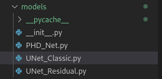
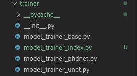
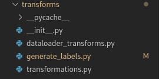
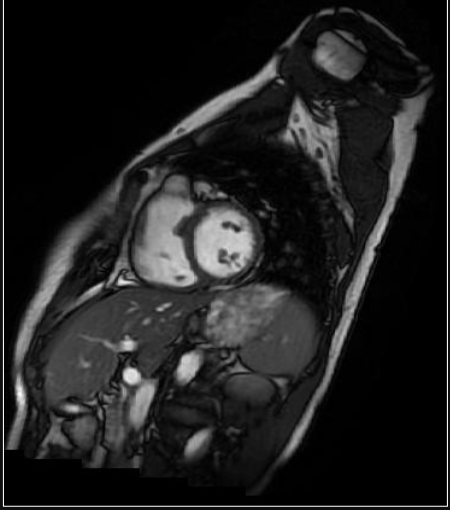

## Adding Your Own Model Architecture and Task
To add your own model architecture, you need to add the Model, The Model Trainer, and the Label Generator. LannU-Net uses super classes with a series of functions you must implement for each of these classes. You can look at model_trainer_unet (U-Net) and model_trainer_phdnet (PHD-Net) as examples on how to implement them yourself. U-Net is the standard method, and PHD-Net is extremely different, so there is a lot of flexibility here. If doing normal heatmap regression but using a new architecture, you will likely be able to copy a lot of the U-Net related functions in the Model Trainer class and the Lavel Generator class and just create a new Model Class.

### The Model Class
Here, you define the architecture and forward pass of your model. Save your model under /LaNNU-Net/models. There are no LannU-Net superclasses to extend here since this is a simple one. 

First create your model class using nn.Module as your super class. In the \__init__ function define the architecture of the model and initialise it. 

Then, add a forward() function that passes your input through the model until you get your output/s. 

You can add more complex things if you want, but the above steps are the minumum.

### The Model Trainer Class
This is the most code you will be writing. Here, you are extending /LaNNU-Net/trainer/model_trainer_base.py to train your new model. This class takes care of the instantiating the dataloader, loads/saves model checkpoint, the training loop, and inference. Have a look in model_trainer_base.py to see what is going on. Almost all of these are taken care of for you. You can see here which functions you must override too (they have @abstractmethod above them), and look at the examples in model_trainer_unet.py and model_trainer_phdnet.py to get an idea of what each overrided function should achieve.

*Make sure you add the key of your new model_trainer in the  model_trainer_index.py dictionary so LannU-Net can find it when you select it in the config using MODEL.ARCHITECURE="trainer_key"!*

When creating your own model trainer, there are 7 functions you must override: \__init__, initialize_network(), initialize_optimizer_and_scheduler(), initialize_loss_function(), get_coords_from_heatmap. 

If you are using classical heatmap regression (like U-Net) and just changing the model, you can most likely copy all the implementations from trainer/model_trainer_unet.py.

- \__init__: Here you can override any parameters in the \__init__ function in model_trainer_base.py e.g. early_stop_patience. You can also define any hyperparameters model you are using (or load them from your custom config file). Here, define your loss function too. Importantly, load in your training and evaluation Label Generators as self.train_label_generator and self.eval_label_generator, respectively. See the next section for the details. **Naming convention matters, match the variable names you are overriding from model_trainer_base.py exactly otherwise LannU-Net will not find them!**

- initialise_network(): Load in your initialized network here called *self.network*. You can reference variables you defined in \__init__. Send it to the device you are using.

- initialize_optimizer_and_scheduler(): Define your list of learnable parameters and initialize your self.optimizer using them.

- initialize_loss_function(): Initialise your deep supervision weights (if using!) and your loss function: self.loss.

- initialize_loss_function(): Initialise your deep supervision weights (if using!) and your loss function: self.loss.

- get_coords_from_heatmap(output, original_image_size): This is the most important function you will implement here. It extracts the final coordinate predictions from the model output(s). For generic heatmap regression, such as model_trainer_unet.py, it resizes the predicted heatmap to original_image_size (optionally, depending on the INFERENCE.EVALUATION_MODE config option), and then extracts the coordinates of the pixel with the highest activation. For PHD-Net, (model_trainer_phdnet.py), it combines the multi-branch output, performs candidate smoothing, and then extracts the coordinates.

### The Label Generator Class
Here, extend LabelGenerator in /LaNNU-Net/transforms/generate_labels.py. We use this class to generate the target labels for our training. In traditional heatmap regression (e.g. U-Net), we use the landmark coordinates to generate the Gaussian heatmap image to regress. Implement the following functions:

- generate_labels(self, landmarks, x_y_corner_patch, landmarks_in_indicator, image_size, sigmas, num_res_levels, lambda_scale=100, dtype=np.float32, to_tensor=True):
    - landmarks ([[int,int]]): A 2D list of ints where each entry is the [x,y] coordinate of a landmark.
    -  x_y_corner_patch ([int, int]): The coordinates of the top left of the image sample you are creating a heatmap for. If you are using the entire image (so SAMPLER.SAMPLE_MODE = 'full'), then this is [0,0]. If you are doing patch-based training, then this is the coordinates where the top left of the image patch is in the original image. See where this function is called in [dataset_base.py](../../datasets/dataset_base.py) for more info on this.
    -  landmarks_in_indicator ([int]): A list of 1s and 0s where 1 indicates the landmark was in the model input image and 0 if not. If using SAMPLER.SAMPLE_MODE = 'full' with no data augmentation, then this list will always be 1s. If using data augmentation, then sometimes a landmark will be cut off and it will be 0. If using SAMPLER.SAMPLE_MODE = 'patch' then some landmarks will be in the patch and others not.
    -  image_size ([int, int]): Size of the heatmap to produce.
    -  sigmas ([float]): List of sigmas for the size of the heatmap. Each sigma is for the heatmap for a level of deep supervision. The first sigma defines the sigma for the full-size resolution heatmap, the next for the half-resolution heatmap, the next for the 1/8 resolution heatmap etc.
    -  num_res_levels (int): Number of deep supervision levels (so should be the length of the list of sigmas. Kind-of redundant).
    -  lambda_scale (float): Scaler to multiply the heatmap magnitudes by.
    -  dtype: datatype of the output label
    -  to_tensor (bool): Whether to output the label as a tensor object or numpy object.

        In this function, use these variables to calculate your labels. The label can be a heatmap, the multi-label for PHD-Net or whatever. Depending on what label you are making, you might need to pass some new variables to the label generator when you *initialise* it (see the PHDNetLabelGenerator example) and use them in the generate_labels() functions (e.g. self.x, self.y). However, it is currently not possible to pass extra sample-specific information to the label generator beyond the variables outlined above. This can be changed in the future following the paradigm in the dataset_base, dataset_generic, dataset_aspire classes of adding stuff to a dictionary and passing it through this function.

- debug_sample(self, sample_dict, image, coordinates):
  - sample_dict (Dict): A dictionary of all the sample-specific information
  - image (tensor): The untransformed input image
  - coordinates: The untransformed coordinates

    You can write a function here to log, print or display (matplotlib) stuff to do with your label generator for debugging. To enable this, set SAMPLER.DEBUG = True in your yaml config.

- stitch_heatmap():
  
   Currently not implemented. You can define this and leave it blank.

## Changing the Loss Function
To add a new loss function, simply add it to the [losses/](../../losses) directory or directly to [losses.py](../../losses/losses.py). 

Then in you model_trainer class, load it in. This is the only place you should be using your loss function. Use a string identifier in your config file in SOLVER.LOSS_FUNCTION for this. See [model_trainer_unet](../../trainer/model_trainer_unet.py) and [model_trainer_phdnet](../../trainer/model_trainer_phdnet.py) for examples.

## Changing the Training Schedule
LannU-Net uses poly scheduler as default. This smoothly reduces the learning rate from the initial learning rate throughout training. 

If you don't want this, then in your own model_trainer class override the  maybe_update_lr() function from [model_trainer_base.py](../..//trainer/model_trainer_base.py).

## Data Augmentation
Data augmentation will improve your results, but you have to be careful not to overdo it.  LannU-Net supports two augmentation packages: [imgaug](https://imgaug.readthedocs.io/en/latest/) and [albumentations](https://albumentations.ai/). Albumentations is faster, but does not support warping images with landmarks. Therefore, *imgaug is recommended and the only one I have properly tested*. You might need to add a little code to the [dataset class](../../datasets/dataset_base.py) to get albumentations to work again.

By default, I have written several schemes of various intensity. They transform the image as well as the target landmarks to the new transformed image.

You can see them all in detail in [get_imgaug_transforms.py](../../transforms/dataloader_transforms.py).  To set which scheme to use, set SAMPLER.DATA_AUG to the corresponding string key.
**I  strongly recommend starting with "AffineComplex"**.

## Full Image vs. Patch-based Training

### Full Image (Default)
By default, LannU-Net trains on entire images, resized to [512,512]. This is set by the default config file, SAMPLER.SAMPLE_MODE = 'full' and SAMPLER.INPUT_SIZE = [512,512]. 

You can change the size of the images trained on by changing SAMPLER.INPUT_SIZE. It is recommended to set this as the median size of the images in your training set. If your images are too big (e.g.e.g. the Cephalometric dataset, size [1935,2400]), you can keep the same ratio as the images in your training set, and use a smaller resolution.

### Patch-Based
Instead of using the entire images, we sample *patches* from the image and train using those. PHD-Net uses this method of training by default.

If your images are too large to fit into memory, you can use patch-based training on the full resolution images instead of resizing them using the default SAMPLER.SAMPLE_MODE = 'full'. Currently, this method has problems converging during training and requires more work.

There are various settings you can alter in the config file under SAMPLER.PATCH, which are detailed [here](advanced_yaml_config.md#changing-the-yaml-config-file).

The most important settings are SAMPLER.PATCH.SAMPLE_PATCH_SIZE, which dictates how large the patch is. 

During inference, we can make a prediction using the full-sized image using SAMPLER.PATCH.INFERENCE_MODE = "fully_convolutional". However, beware of large image sizes as this will require a lot of GPU memory. 

The "patchify_and_stitch" needs to be implemented. The model will sample patches over the full resolution image in a sliding window fashion, with a stride of half the patch size, stitching together all the predictions to give the final output. Since the borders of each patch are less accurate than the center, we weight the predictions with a Gaussian centered on the middle of the patch. Therefore, the resolution of the entire image does not matter.

## Sigma Regression
For heatmap regression, we define the variance of the 2D Gaussian function as a hyperparameter (in the config file, MODEL.GAUSS_SIGMA). However, to find the optimal sigma, we need to perform a search or inject some domain knowledge on how tricky this landmark is to localize. Instead, we could regress this sigma as part of the learning process. We can take this a step further, and regress an entire covariance matrix.

I have implemented regressing sigma, but it doesn't seem to converge. **It only works for model_trainer_unet.py**.  More work needed. Enable this by setting in the config file: SOLVER.REGRESS_SIGMA = True. You can change the weighting in the loss function using SOLVER.REGRESS_SIGMA_LOSS_WEIGHT = 0.005.

First, I added sigma as a learnable parameter (check initialize_optimizer_and_scheduler() in model_trainer_unet.py. Then in initialize_loss_function() I add sigma to the loss function.
Then in model_trainer_base.py I update the sigma during optimization using update_dataloader_sigmas(). Check out these functions for the flow.

## Uploading your Trained Model
You can upload your trained model to the model zoo and create a config file on how to train and perform inference. 

###  1) Upload your model
Fill out this [google form](https://docs.google.com/forms/d/18m1bFiigRQeAgo1JV_oNae4J043uup_z4w8Y4josMIk/viewform?edit_requested=true&fbzx=-4037264140426870860), where you upload the files for your trained model. Make sure to upload a model for each fold of the dataset. I will then upload it to the model zoo.

###  2) Create an example
Under /LaNNU-Net/examples, create a subdirectory for your example like:

    configs/examples/model_name/dataset/

Here create a config file for training and inference. Write an inference file for each fold, and write an example for training, too. e.g.

Check out these .yamls for how to do it.

**Important**: You won't be able to fill in MODEL.MODEL_GDRIVE_DL_PATH, because the google form won't give you that info. Don't worry, I will fill that in for you later. Just leave it blank for now. I'm not sure of a better system than this, if you know a better one let me know.

Then add a little README.md file to explain how to run it. You should add a section under [Implemented Models](implemented_models.md#) to describe your model, and link to that section here. Check out the [U-Net_Classic_README](../../configs/examples/U-Net_Classic/U-Net_Classic_README.md#) for an example.

###  3) Update the config documentation

Please update the [Changing the .yaml Config File](advanced_yaml_config.md#changing-the-yaml-config-file) with your added config options.