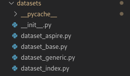

# Advanced Configuration

## Advanced Dataset Configuration
If you want to add extra attributes associated with each sample e.g. a patient ID, a year of the scan etc, you can. Then, during inference you can save this info alongside the prediction for each patient. 

First, when you generate your JSON file, simply add an additional key in each sample's dictionary. See the example below where we add the attributes "extra_info".

    {
        "name": "ASPIRE BASELINE + FOLLOWUP",
        "description": "Cardiac MRI 4ch View Images.",
        "fold": 0,
        "testing": 
            [
                {
                    "id": "PHD_430",
                    "coordinates": 
                        [
                            [320.0, 316.0], 
                            [228.0, 339.0],
                            [259.0, 220.0], 
                            [340.0, 220.0],    
                        ],
                    "image": "PAH-Baseline/Proc/4ch/PHD_430/phase_1.npz",      
                    "extra_info": 123       
                },
                {
                    "id": "PHD_431",
                    "coordinates": 
                        [
                            [320.0, 316.0], 
                            [227.0, 329.0],
                            [239.0, 220.0], 
                            [360.0, 210.0],    
                        ],
                    "image": "PAH-Baseline/Proc/4ch/PHD_431/phase_1.npz",     
                    "extra_info": 124   
          
                }
            ],
       
    }

Then, extend [dataset_base.py](../../datasets/dataset_base.py) and define a list called additional_sample_attribute_keys with the keys you want to save in the output csv files. Pass these through to super.\__init__ function.See [dataset_aspire.py](../../datasets/dataset_aspire.py)  of an example of how to do this. In that example we wanted to save the suid of the CMRI along with the patient ID in the output csv file so the doctor's could match the patient and scan to their database.

Make sure you set the DATASET.DATASET_CLASS to the name of your new dataset class in the yaml file and add the key to [dataset_index.py](../../datasets/dataset_index.py).

## Changing the .yaml Config File
There are many other options you can configure in the .yaml config file. All default options can be found in the [default config file](../../config.py). Simply override these configurations in your own config file, as you did when [creating your .yaml config file](using_own_dataset.md#3-create-a-yaml-config-file). You can change the following options:

The list is quite overwhelming, but the key ones to get started are explained in [Create A yaml Config File](using_own_dataset.md#3-create-a-yaml-config-file).

### DATASET
Parameters concerning dataset details and dataset paths.
- **DATASET_CLASS** (str): The name of the dataset class to use. The  class must be implemented following the instructions [here](advanced_yaml_config.md#advanced-dataset-configuration).
    
     *Default:* "generic" - This should be good for the average user.

- **ROOT** (str): The path to the root image folder. Organized as described [here](using_own_dataset.md#1-expected-directory-format).
    
     *Default:* '''

- **Name** (str): The name of the dataset.
    
     *Default:* '''

- **SRC_TARGETS** (str): The path to either the JSON annotation root folder (when using CV), or exact JSON annotation file (when not using CV), as described [here](using_own_dataset.md#2-create-a-json-file).
    
     *Default:* '''
    
- **IMAGE_MODALITY** (str): The modality of the images e.g. CMRI, Cephalometric, CT etc.
    
     *Default:* 'CMRI'

- **LANDMARKS** (str): The indices of the landmarks in the JSON file. For example, if the JSON file has 4 landmarks, and you want to use the first 3, then the list should be [0,1,2].
    
     *Default:* [ ]

- **TRAINSET_SIZE** (int): The number of samples to use from your training set. If you want to use all samples, leave this as -1.
    
     *Default:* -1
  

### SAMPLER
Parameters concerning both full image & patch sampling, data augmentation and cpu workers.

- **DEBUG** (bool): If True, will display plots to help debug the sampler and write to logs. See [Debugging](debugging.md) for more detail.

    *Default:* False

- **INPUT_SIZE** [int, int]: The size you want to resize the images to for training. Regardless of resolution uniformity in the dataset, you need to resize them to a common size. If possible, use the median size of the dataset. If the median resolution is too big to fit into memory, [512, 512] is a good bet. Alternatively you can use full-resolution images and do patch-based sampling, explained in [Patch-Based Training](adding_new_models.md#patch-based).
    
     *Default:* [512, 512] 

- **DATA_AUG** (str): The data augmentation scheme to use. See [Data Augmentation](adding_new_models.md#data-augmentation) for a list of the different schemes. Set to None for no data augmentation.

    *Default:* 'AffineComplex'

- **DATA_AUG_PACKAGE** ('imgaug' OR 'albumentations'): The data augmentation package to use. Albumentations is faster, but does not support all the augmentations that imgaug does. See [Data Augmentation](adding_new_models.md#data-augmentation) for more details.

    *Default:* 'imgaug'

- **NUM_WORKERS** (int): How many CPU workers to handle the dataloader. This is hard to get right. As a rule of thumb, try to set it to the amount of CPU cores you have, but in my experience do not set higher than 8. If you want everything to happen in the same thread, leave as 0. This parameter can give you a large speed-up if you are using heavy augmentation. See these threads for more reading: [here](https://discuss.pytorch.org/t/guidelines-for-assigning-num-workers-to-dataloader/813) and [here](https://pytorch.org/docs/stable/data.html). 

    *Default:* 0

    
- **SAMPLER_MODE** ("full" OR "patch_bias"): The sampling mode. "full" will resize images to the resolution of SAMPLER.INPUT_SIZE, and use these images for training (recommended). "patch_bias" will sample patches from the images using the settings of SAMPLER.PATCH (beta). "patch_centred" will sample patches from the image accordining to settings from SAMPLER.PATCH.CENTRED_PATCH_XXX.
    
     *Default:* "full"

#### SAMPLER.PATCH
Parameters concerning patch sampling strategy

- **RESOLUTION_TO_SAMPLE_FROM** ('full' OR 'input_size'): Whether to sample patches from the full resolution image ('full'), or to resize all images to SAMPLER.INPUT_SIZE and then sample patches from there.

    *Default:* 'full'
        ** TODO: FIX, THIS IS NOT IMPLEMENTED YET.**

- **SAMPLE_PATCH_SIZE** ([int, int]): The size of the patches to sample from the loaded image of size SAMPLER.PATCH.RESOLUTION_TO_SAMPLE_FROM. e.g. if you want to sample patches of size 256x256 from the whole image, then set this to [256, 256] 
    
     *Default:* [128, 128]

- **SAMPLER_BIAS** (float): *Only relevant if SAMPLE_MODE="patch_bias."* Bias of the sampler to choose patches with landmarks in them. If set to 0, the sampler will choose patches randomly. If set to 1, the sampler will always choose patches with at least one landmark in them. If set to 0.5, 50% of all patches are gauranteed to contain the landmark, the remaining 50% are randomly sampled. 
    
     *Default:* 0.66

- **CENTRED_PATCH_COORDINATE_PATH** (string):  *Only relevant if SAMPLE_MODE="patch_centred."* Path to landmark predictions from a previous stage. The format of the .xlsx should be the same as the individual_results output files from LaNNU-Net. The sampler will then be biased to sampling patches around these landmarks.

- **CENTRED_PATCH_COORDINATE_PATH_SHEET** (string):  *Only relevant if SAMPLE_MODE="patch_centred."* The sheet in the .xlsx file from CENTRED_PATCH_COORDINATE_PATH to get the landmark coordinates from.

- **CENTRED_PATCH_JITTER** (float):  *Only relevant if SAMPLE_MODE="patch_centred."* The amount of jitter from the landmark coordinates from CENTRED_PATCH_COORDINATE_PATH to sample patches from. The jitter must be between 0 and 1 (A proportion of the patch), and is sampled from a uniform distribution between [-CENTRED_PATCH_JITTER*(patchsize/2), CENTRED_PATCH_JITTER*(patchsize/2)]. If jitter is set to 0, the sampler will only sample patches with the centre at the initial coordinates. If set to 1, the patch could only contain the landmark on the very edge. See the function sample_patch_centred in /utils/im_utils/patch_helpers.py for more detail.
  
- **INFERENCE_MODE** ("patchify_and_stitch" OR "fully_convolutional"): 
    
    *"patchify_and_stitch"*: the model will sample patches over the full resolution image in a sliding window fashion, with a stride of half the patch size, stitching together all the predictions to give the final output. Since the borders of each patch are less accurate than the center, we weight the predictions with a Gaussian centered on the middle of the patch.

    *"fully_convolutional"*: the full-sized image will be passed to the network. Beware of large image sizes, as this will require a lot of GPU memory. 

    *Default:* 'fully_convolutional'

    TODO: "patchify_and_stitch" NOT IMPLEMENTED YET.

**Warning**: If using large images (above [512,512]), set SAMPLER.INPUT_SIZE = [512,512] and SAMPLER.PATCH.RESOLUTION_TO_SAMPLE_FROM = "input_size". This is because currently "patchify_and_stitch" is not implemented, so if you are using large images (e.g. [1935, 2400]) SAMPLER.PATCH.RESOLUTION_TO_SAMPLE_FROM = "full" and PATCH.INFERENCE_MODE = "fully_convolutional" will be too large for GPU memory and crash.

### SOLVER
Configurations for the back propagation algorithm, learning rate policy, loss function, dataloader batch size, mixed precision and regressing sigma.

- **SEED** (int): Seed for random number generators.
    
     *Default:* None

- **BASE_LR** (float): Initial learning rate
    
     *Default:* 0.01

- **DECAY_POLICY** ("poly" or None): The learning rate decay policy. If None, the learning rate will not decay.
    
     *Default:* "poly"

- **MAX_EPOCHS** (int): Number of epochs to train for.
    
     *Default:* 1000

- **EARLY_STOPPING_PATIENCE** (int): If validation loss does not improve for this number of epochs, training will stop.
    
     *Default:* 150

- **MINI_BATCH_SIZE** (int): How many mini-batches of size SOLVER.DATA_LOADER_BATCH_SIZE_TRAIN to train with per epoch.
    
     *Default:* 150

- **DATA_LOADER_BATCH_SIZE_TRAIN** (int): Number of samples per batch during training. Set as large as you can without running out of memory. Will automate this in future.
    
     *Default:* 12

- **DATA_LOADER_BATCH_SIZE_EVAL** (int): Number of samples per batch during evaluation. Set as large as you can without running out of memory. Will automate this in future.
    
     *Default:* 12

- **DEEP_SUPERVISION** (bool): Whether to use deep supervision or not. Deep supervision is a technique to improve the accuracy of the model by training it to predict the landmarks at multiple scales.

     *Default:* True

- **NUM_RES_SUPERVISIONS** (int): How many layers to propagate the deep supervison to. If set to 1, the loss will only be calculated using the full resolution target heatmap and the last resolution layer's prediction. If set to 2, the supervision will be propagated to the last 2 layers, with correspondingly lower resolution target heatmaps. In general, the higher this number, the better the performance. The rule of thumb is to set this to the number of resolution layers in the network minus 2 (so all but the lowest two layers).

     *Default:* 5

- **AUTO_MIXED_PRECISION** (bool): Whether to use Pytorch's automatic mixed precision. This will speed up training dramatically, but may cause some numerical instability. If you are getting NaNs, try setting this to False. See [this](https://pytorch.org/docs/stable/notes/amp_examples.html) for more details.

     *Default:* True

- **LOSS_FUNCTION** ("mse" or "awl"): The loss function to train the network with. "mse" is the standard mean squared error loss. "awl" is Adaptive Wing Loss from this [paper](https://arxiv.org/abs/1904.07399). This loss function is only available for U-Net. It doesn't work at all really. I'm not sure why. I'm leaving it in for now in case someone wants to try and fix it.

     *Default:* "mse"

- **REGRESS_SIGMA** (bool): Whether to regress the value of sigma for the Gaussian heatmap label rather than it be a fixed hyperparameter (MODEL.GAUSS_SIGMA). This will be a part of the loss function to be optimised. See this [paper](https://arxiv.org/abs/2109.09533) for an idea of what is happening. This is implemented for U-Net but doesn't work properly yet. It is not implemented for PHD-Net yet.
     
     *Default:* False

- **REGRESS_SIGMA_LOSS_WEIGHT** (float): The loss function weighting for the sigma regression.

     *Default:* 0.005

### TRAINER
Configurations for the trainer. These are high level configurations that are not specific to the model.

- **PERFORM_VALIDATION** (bool): Whether to perform validation during training.

     *Default:* True

- **VALIDATE_EVERY** (int): How many epochs to wait before performing validation. e.g. if 10, it will validation on epoch 0,10,20 etc.

     *Default:* 10

- **SAVE_LATEST_ONLY** (bool): If set to True, latest checkpoint will be saved and overwrite the last. If set to False, a checkpoint will be saved after every epoch. Regardless, checkpoints are saved whenever the validation loss improves.

     *Default:* True

- **CACHE_DATA** (bool): If set to True, the dataset will be loaded into memory at the start of training. This will dramatically speed up training, but will require a lot of memory (RAM). If set to False, the dataset will be loaded from disk every time a batch is requested. This will be slower, but will require less memory. *Strongly recommended to set to True if your dataset is small.*

     *Default:* True

- **FOLD** (int): Which fold to train on. This will match your JSON annotation file that you named "fold0.json", "fold1.json" etc from [Create a JSON file](using_own_dataset.md#2-create-a-json-file). If set to -1, then it will load the exact JSON specified in DATASET.SRC_TARGETS instead.

     *Default:* 0

- **INFERENCE_ONLY** (bool): If True, will only perform inference on the dataset specified in DATASET.SRC_TARGETS. If you specify a checkpoint in MODEL.CHECKPOINT, it will perform inference and save results on all checkpoints. If MODEL.CHECKPOINT is None, it will perform inference on all model checkpoints found in OUTPUT.OUTPUT_DIR.  If False, will train the model.

     *Default:* False

### MODEL
Configurations relating to model choice. Includes sub-configurations for each model architecture. If you add another model, include the options here following this format (e.g. MODEL.PHD_NET and MODEL.UNET).

- **ARCHITECTURE** ("U-Net" or "PHD-Net"): Which model to use. IF you add another model, include the options here following this format.

     *Default:* "U-Net"

- **GAUSS_SIGMA** (int): The sigma value for the Gaussian heatmap label. This is a fixed hyperparameter. If REGRESS_SIGMA is set to True, sigma will be initially set to this value but be optimized.

     *Default:* 4

- **HM_LAMBDA_SCALE** (float): Scalar to multiply the heatmap by i.e. if set to 100.0, the maximum heatmap value is 100.0 rather than 1.0. This is a heuristic that can speed up training since it increases the magnitude of the loss function. It is not necessary, but can help.

     *Default:* 100.0

- **CHECKPOINT** (str): The path to a checkpoint to load. If still training, this can be used to continue training from this point. If performing inference, this model will be loaded. If set to None during inference, instead all models in OUTPUT.OUTPUT_DIR will be loaded and results saved seperately. If performing ensemble inference (INFERENCE.ENSEMBLE_INFERENCE = True) this is ignored, and the checkpoints that are loaded are indicated in INFERENCE.ENSEMBLE_CHECKPOINTS. 

     *Default:* None

- **MODEL_GDRIVE_DL_PATH** (str): The path to a model on the Google Drive Cloud, which will be downloaded and used if provided. It will be downloaded to whatever you provide as MODEL.CHECKPOINT, so make sure you provide a checkpoint that doesn't exist if using this.

#### MODEL.UNET
Config parameters for the default U-Net model found [here](../../models/UNet_Classic.py). More documentation for this model can be found [here](implemented_models.md#u-net)
 - **MIN_FEATURE_RESOLUTION** (int): This relates to the automatic configuration of the U-Net architecture. The architecture will continuously downsample the feature resolution and add a symmetrical layer until the feature resolution reaches a minimum resolution of ([int, int]). For example, if you set MIN_FEATURE_RESOLUTION = 4 and your SAMPLER.INPUT_SIZE = [512,512], the architecture will downsample the feature resolution until it reaches 4x4 i.e. 512 -> 256 -> 128 -> 64 -> 32 -> 16 -> 8 -> 4. Therefore, the architecture will have 8 layers.

     *Default:* 4

 - **MAX_FEATURES** (int):  This relates to the automatic configuration of the U-Net architecture. Each time the network halves the feature resolution, it doubles the number of kernels up to a maximum of MAX_FEATURES. Following the example above in MIN_FEATURE_RESOLUTION and assuming the number of initial kernels is 32 (INIT_FEATURES), the number of convolutional layers in each resolution step of the encoding half will be 32 -> 64 -> 128 -> 256 -> 512 -> 512 -> 512 -> 512. 

     *Default:* 512
    

 - **INIT_FEATURES** (int):  This relates to the automatic configuration of the U-Net architecture. The initial number of output channels (kernels) of the first layer. 

    *Default:* 32
    

#### MODEL.PHD-NET
Config parameters for the PHD-Net model found [here](../../models/PHD_Net.py).  More documentation for this model can be found [here](implemented_models.md#phd-net).
- **BRANCH_SCHEME**
- **MAXPOOL_FACTOR**
- **CLASS_LABEL_SCHEME**
- **WEIGHT_DISP_LOSS_BY_HEATMAP**
- **LOG_TRANSFORM_DISPLACEMENTS**
- **CLAMP_DIST**

#### INFERENCE
Parameters relating to inference time.

 - **EVALUATION_MODE** ("scale_heatmap_first" OR "scale_pred_coords", OR "use_input_size"):  How to process the model output before predicting the final coordinates. Note, the heatmap-derived uncertainty metrics are always extracted directly from the model's output heatmap e.g. S-MHA is from the SAMPLER.INPUT_SIZE heatmap even if you choose "scale_heatmap_first".

    *"scale_heatmap_first"*: First scales the heatmap from SAMPLER.INPUT_SIZE to the image's original size using Bicubic upsampling. The coordinates are extracted here.  

    *"scale_pred_coords"*: Extracts coordinates from the output heatmap of SAMPLER.INPUT_SIZE and scales them to the original image size.

    *"use_input_size"*: Extracts coordinates from the output heatmap of SAMPLER.INPUT_SIZE and does not scale them.

    *Default:* "scale_heatmap_first"

- **FIT_GAUSS** (bool): If False, uses maximum heatmap activation as the predicted landmark, if True, first fits gaussian to output heatmap using a robust least squares fit method (very slow).

    *Default:* False

- **ENSEMBLE_INFERENCE** (bool):

    *False*: Performs inference using a single model. If MODEL.CHECKPOINT **is not** None it will use that model checkpoint for inference. If  MODEL.CHECKPOINT is None it will perform inference over all model checkpoints in OUTPUT.OUTPUT_DIR and save results separately.

    *True*: Performs inference using an ensemble of models, whose paths are defined in INFERENCE.ENSEMBLE_CHECKPOINTS. More details of this process are found under Section [Ensembling and Uncertainty](ensembling_and_uncertainty.md#ensembling-and-uncertainty).

    *Default*: False

- **ENSEMBLE_CHECKPOINTS** ([str]): List of paths to model checkpoints to use for ensemble inference. If INFERENCE.ENSEMBLE_INFERENCE = True, these checkpoints are loaded for ensemble inference, ignoring the path in MODEL.CHECKPOINT.

    *Default*: None

- **ENSEMBLE_UNCERTAINTY_KEYS** ([str]): Keys for the uncertainty estimation methods to use. So far, only S-MHA (key: "smha"), E-MHA (key: "emha"), and E-CPV (key: "ecpv")are implemented. See Section [Ensembling and Uncertainty](#ensembling-and-uncertainty) for more details.

    *Default*: ["smha", "emha", "ecpv"]

- **UNCERTAINTY_SMHA_MODEL_IDX** (int): The index of the model you want to use for S-MHA e.g. if you choose the value 2, and your INFERENCE.ENSEMBLE_CHECKPOINTS is a list of 5 models, this will select the third model to calculate S-MHA.
  
    *Default:* 0

- **DEBUG** (bool): If True, shows inference debug information e.g. plots of predicted heatmaps and landmarks. See [Debugging](debugging.md) for more info.

    *Default*: False

#### OUTPUT
Parameters relating to where and how to save model outputs, and the Comet.ml logger. For more info on the Comet.ml logger see [Logging](logging.md).

- **VERBOSE** (bool): If True, logs extra debugging info. If False, just standard logging. (Currently does not do anything.)

    *Default*: True

- **OUTPUT_DIR** (str): Path to the directory to save model outputs, model checkpoints and final results to.

    *Default*: "/output/"

- **USE_COMETML_LOGGING** (bool): If True, logs to Comet.ml. If False, does not log to Comet.ml. **Strongly recommended for researchers/developers**. See [Logging](logging.md) for more info.

    *Default*: True

- **COMET_API_KEY** (str): Your Comet.ML API key. 
    
    *Default*: None

- **COMET_WORKSPACE** (str): Your Comet.ML workspace to save experiments to.
    *Default*: "default"

- **COMET_PROJECT_NAME** (str) The Comet.ML project name to save experiments to.

    *Default*: "LannU-Net"

- **COMET_TAGS** ([str]): List of tags to save to your comet.ml experiment.

    *Default*: ["default"]

- **COMET_PROJECT_NAME** (str): Which Comet.ml project to save your experiment to.

    *Default*: "LannU-Net"

- **RESULTS_CSV_APPEND** (str or None): A string to add to your output CSV. Useful if you are saving several results from the same OUTPUT.OUTPUT_DIR so they don't get overwritten.

    *Default*: None

#### SSH
Parameters if your data or output paths or mounted on SSH.Use if your data is on an SSH mount and you want to load data & save results to this mount (common if you are using HPC). Only use this if you understand it.

- **AUTO_AMEND_PATHS** (bool): If True, automatically amends file paths based on SSH configuration. If False, file paths will not be amended. If set to True, set your SRC_TARGETS, OUTPUT_DIR AND ROOT to the path you usewhen you are running the program inside your SSH mount.

Default: True

- **LOCAL_PATH_TO_SSH_MOUNT** (str): Path to the local directory where the SSH mount is located. 

Default: "/mnt/bess"

- **MATCH_SSH_STRING_FOR_AMEND** (str): The SSH string used to match and amend file paths.

Default: '/shared/tale2/'

Example:

DATASET.ROOT: "/shared/tale2/Shared/schobs/data/ISBI2015_landmarks"

and

SSH.LOCAL_PATH_TO_SSH_MOUNT = "/mnt/tale_shared/".

The code will detect if you are running locally instead of via SSH and change:
DATASET.ROOT = "/mnt/tale_shared/shared/tale2/Shared/schobs/data/ISBI2015_landmarks".
 
