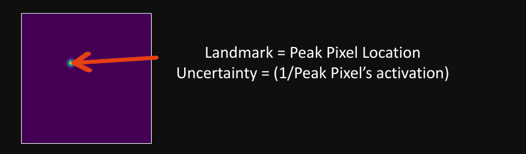
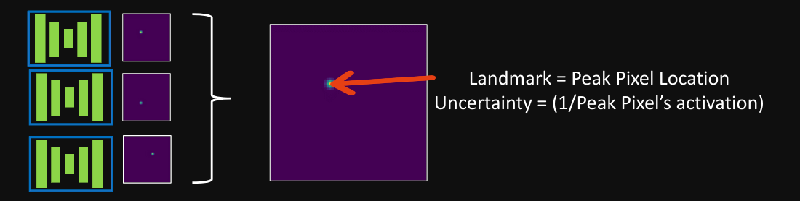
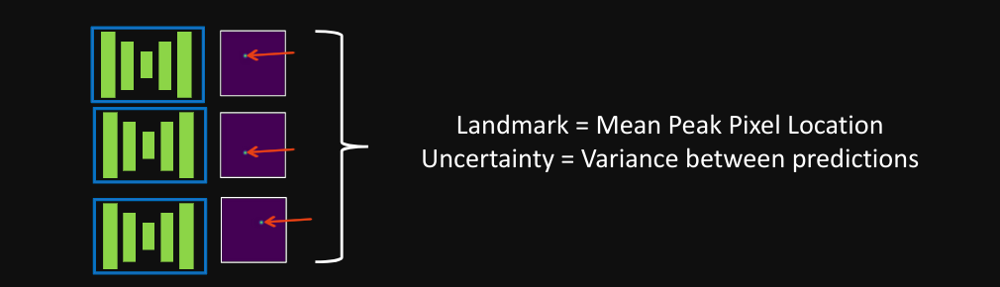

# Advanced Features
## Ensembling and Uncertainty
You can train multiple models and ensemble them together at inference time. They must be of the same architecture. All you need to do is alter the config file: INFERENCE.ENSEMBLE_INFERENCE = True, and provide the paths to the list of model checkpoints in INFERENCE.ENSEMBLE_CHECKPOINTS.

LannU-Net follows the strategy in [Uncertainty Estimation for Heatmap-based Landmark Localization](https://arxiv.org/abs/2203.02351), saving three sets of results along with an uncertainty measure for each.

**If not ensembling, only the S-MHA is saved.**

- S-MHA (Single Maximum Heatmap Activation):  LannU-Net selects the first model in the INFERENCE.ENSEMBLE_CHECKPOINTS list, uses the Maximum Heatmap Activation (MHA) of the map to predict the landmark and saves the activation as uncertainty.

- E-MHA (Ensemble Maximum Heatmap Activation):  LannU-Net calculates the average heatmap of all models and uses the MHA of the average map as the prediction and uncertainty.

- E-CPV (Ensemble Coordinate Prediction Variance):  LannU-Net uses the MHA of each individual heatmap in the ensemble to gather a coordinate prediction for each model. The final prediction is the average coordinate, and the uncerainty is the variance between these predictions.

**If not ensembling, only the S-MHA is saved.**
