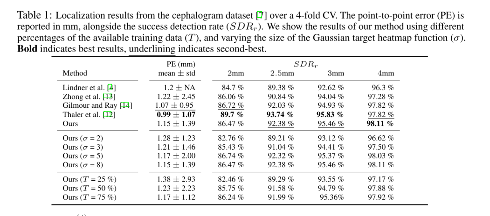

# Implemented Models

# Table of Contents
- [U-Net](#u-net)
- [PHD-Net](#phd-net)
  
## U-Net

### Summary of Method
U-Net follows the encoder-decoder architecture, originally proposed by Ronneberger et al, [here](https://arxiv.org/abs/1505.04597).     

It learns an image-to-image translation between the input image and a heatmap centered on the landmark of interest.

Inspired by nnU-Net [1]  for image segmentation, we hypothesize that a vanilla U-Net with a careful training regime contains enough expressive power to perform on par with tailored architectures. 

We design a vanilla U-Net following the template of the original U-Net [2] and nnU-Net [1]. The U-Net follows the standard configuration of two blocks per resolution layer, with each block consisting of a $3 \times 3$ convolution, Instance Normalization [3], and Leaky ReLU (negative slope, 0.01). Downsampling is achieved through strided convolutions and upsampling through transposed convolutions. The initial number of feature maps is configurable (default: 32), doubling with each downsample to a maximum of 512 by default and halving at each upsample step. We automatically configure the number of resolution layers by adding encoder steps until any dimension of the feature map resolution hits some minimum (default: 4).

### Config Options

The config for the default model, explictly showing the relevent config options, trained for the Cephalometric dataset is in the file `LaNNU-Net/configs/examples/U-Net_Classic/Cephalometric/unet_cephalometric_fold0_train.yaml`. 

To see details of all the config options specific to this model, please see [U-Net Config](advanced_yaml_config.md#modelunet).

### Method Details
**Training scheme:** We use the standard landmark localization objective function: the Mean Squared Error (MSE) between the Gaussian target heatmap and the predicted heatmap ($\sigma$ of the Gaussian is a hyperparameter). To speed up convergence we increase the magnitude of the loss of the negative class by setting all zero values in the Gaussian heatmap to $-1$. We implement deep supervision, injecting losses at every resolution of the network except the lowest two. This technique facilitates a coarse localization at lower feature resolutions, achieving similar effects to the attention mechanism in [13] and \textit{Spatial Configuration} component of [5]. Unlike the patch-based sampling of nnU-Net, we force images to be a size no larger than $512 \times 512$ and perform training and inference on the entire down-sized image. Patch-based training does not converge in our training scheme since \textit{the signal of the target map is sparser for landmark localization compared to image segmentation}.

We train for 500 epochs using Stochastic gradient descent with an initial learning rate of 0.01, decaying it using the ‘poly’ scheme, $\left(1-epoch/epoch_{max}\right)^{0.9}$ [6]. One epoch consists of 150 mini-batches, where each mini-batch is 12 samples. We employ early stopping using a hold-out validation set (10\% of training set), stopping training if the validation set's localization error does not drop for 150 epochs. We employ data augmentations with a probability of 0.5, uniformly sampling from a continuous range [$\alpha$, $\omega$]: Random scaling [0.8, 1.2],  translation [-0.07\%, 0.07\%], rotation [-45$\degree$, 45$\degree$], shearing [-16, 16] and vertical flipping.

### Results

**Here, we report results on the Cephalometric dataset**.

Table. 1 shows our vanilla U-Net produces fewer gross mispredictions than the previous SOTA, achieving a SDR_{4mm} result of 98.11% - a slight improvement over 97.82% [12]. However, our method is not the best in terms of precision, with an SDR_{2mm} of 86.47% compared to 89.7% from the approach by [12]. Overall, we achieve better or comparable results to tailored architectures [14, 12] and an approach using an attention mechanism [13]. 

Our model is trained on images of size 512 x 512, and we upscale the resulting heatmap to the original image size of 1935 x 2400. Consequently, a PE of a single pixel in the model output propagates to a ~4.2 pixel error (0.42mm) in the final upscaled prediction. Therefore, due to the convincing performance in the coarser SDR_{4mm} evaluation metric, we hypothesize that the slightly worse performance in SDR_{2mm} is in part caused by the quantization error from transforming the low-resolution output image to the final coordinate prediction. 

Table. 1 also shows results varying the value of σ in our target heatmap. When the performance of recent models is so close, this hyperparameter alone has a significant impact on the standings of our method. It would be reasonable to expect that an extensive hyperparameter search would achieve SOTA on this dataset. Finally, Table. 1 shows the performance of our model under the constraint of smaller training set sizes. We show that even with 25% of the training data, our vanilla U-Net performs surprisingly robustly. However, future work is needed to test the validity of these results beyond a single dataset.

In summary, our results suggest that a vanilla U-Net holds enough expressive power for the task of landmark localization in Cephalograms, held back in terms of precision by the bottleneck of the input image size. Our future work will involve evaluating this automatically configuring U-Net on more imaging datasets, tackling the input-size bottleneck through refined patch-based training, and removing the hyperparameter σ by directly regressing it instead.

### References
**References only apply to this subsection, U-Net.**

[1] Isensee, F., Jaeger, P., Kohl, S., Petersen, J., & Maier-Hein, K. (2021). nnU-Net: a self-configuring method for deep learning-based biomedical image segmentation. Nature methods, 18(2), 203–211.

[2] Ronneberger, O., Fischer, P., & Brox, T. (2015). U-Net: Convolutional networks for biomedical image segmentation. In Proc. MICCAI (pp. 234–241).

[3] Ulyanov, D., Vedaldi, A., & Lempitsky, V. (2016). Instance normalization: The missing ingredient for fast stylization. arXiv preprint arXiv:1607.08022.

[4] Claudia Lindner, Ching-Wei Wang, Cheng-Ta Huang, Chung-Hsing Li, Sheng-Wei Chang, and Tim F Cootes. Fully automatic system for accurate localisation and analysis of cephalometric landmarks in lateral cephalograms. Scientific Reports, 6(1):1–10, 2016.

[5] Payer, C., Štern, D., Bischof, H., & Urschler, M. (2019). Integrating spatial configuration into heatmap regression based CNNs for landmark localization. Med. Image Anal., 54, 207–219.

[6] Liang-Chieh Chen, George Papandreou, Iasonas Kokkinos, Kevin Murphy, and Alan L Yuille. Deeplab: Semantic image segmentation with deep convolutional nets, atrous convolution, and fully connected crfs. IEEE transactions on pattern analysis and machine intelligence, 40(4):834–848, 2017

[12] Franz Thaler, Christian Payer, Martin Urschler, Darko Štern, et al. Modeling annotation uncertainty with gaussian heatmaps in landmark localization. J. Mach. Learn. Biomed. Imag., 1:1–10, 2021. Art. no. 014.

[13] Zhusi Zhong, Jie Li, Zhenxi Zhang, Zhicheng Jiao, and Xinbo Gao. An attention-guided deep regression model for landmark detection in cephalograms. In Proc. MICCAI, pages 540–548. Springer, 2019

[14] Logan Gilmour and Nilanjan Ray. Locating cephalometric X-Ray landmarks with foveated pyramid attention. In Medical Imaging with Deep Learning, pages 262–276. PMLR, 2020.

## PHD-Net 

### Summary of Method
PHD-Net as described by Schobs et al, [here](https://ieeexplore.ieee.org/document/9433895). It is a patch-based multi-task learning model that learns to localize landmarks through a heatmap regression and a displacement regression task.

PHD-Net formulates landmark localisation as a multi-task problem: **(1) Heatmap regression**: We regress a Gaussian heatmap centered around the landmark-containing patch to provide smoother supervision. **(2) Coordinate calculation**: To improve the robustness and accuracy of the final coordinate prediction, we propose a *Candidate Smoothing* strategy. We consider each patch's prediction from the displacement output as a small Gaussian blob, producing *locally accurate* candidate predictions, and then regularise them by the predicted Gaussian heatmap from the *heatmap regression* branch. 

We adopt the architecture of Noothout et al. [1] as the backbone of our network. In short, it composes three convolutional layers of 32 filters with $3\times 3$ kernels, each followed by a maxpooling layer with $2\times 2$ kernels. After these layers, the input is broken into $8\times 8$ pixel patches, each patch being represented by a single channel. Three convolutional layers with the same properties follow, before branching into two sets of fully connected layers with 64 and 96 filters, modelled as $1\times 1$ convolutional layers. One branch outputs the displacement prediction, and the other outputs the heatmap prediction. The model is compact with only 0.06M trainable parameters, enabling fast training.

### Config Options
@Tom - please could add this?

### Results
@Tom - please could add this?

### Method Details

#### Joint Displacement and Heatmap Regression

We make two predictions for each patch: the heatmap value and the displacement from the centre of the patch to the landmark. This provides two opportunities to discover the landmark: the *displacement regression* branch focuses on generating pixel-precise candidate coordinates, and the *heatmap regression* branch focuses on the more coarse object-detection task. Framing the task in this fashion facilitates predictions that are pixel-precise despite the output map's low resolution compared to the full image (due to patch-wise predictions, not pixel-wise). The total loss $\mathcal{L}_A$ consists of the displacement loss $\mathcal{L}_d$ and the heatmap loss $\mathcal{L}_h$:

$\mathcal{L}_A = \mathcal{L}_d + \mathcal{L}_h$

The displacement loss $\mathcal{L}_d$ is a weighted sum of the mean squared error (MSE) between the predicted and annotated 2D displacement of each patch. The further the patch is from the landmark, the lower its predictive power. Thus, we dampen the effect of distant patches in two ways: (1) we apply the log function to the displacement labels and (2) we weigh closer patches as more important than distant ones by multiplying the error of the patch-wise predictions by a Gaussian heatmap centered around the landmark.

The heatmap loss $\mathcal{L}_h$ is the MSE between the predicted patch-wise heatmap and the ground truth patch-wise heatmap. To generate the ground truth heatmap, we define the mean as the patch containing the landmark, with a predefined standard deviation. For a landmark $l_i$ contained in the patch $(l_i^x, l_i^y)$, the 2D Gaussian heatmap image is defined as the 2D Gaussian function:

$G_i(\mathbf{x} | \mu=(l_i^x, l_i^y); \sigma): \mathbb{R}^d \rightarrow \mathbb{R}$

The patch mapping's peak value is on the patch containing the landmark, with values smoothly attenuating with distance. Each patch's heatmap value now represents a pseudo-probability of the landmark being contained in it.
Candidate Smoothing

The next challenge is to calculate the final coordinate values from the model's outputs. We propose a strategy to combine the outputs from both branches into a final coordinate prediction value, increasing robustness against misidentifications and assigning a confidence level to the prediction. The key idea behind this strategy is to use a large number of patches to produce locally precise but ambiguous candidate predictions, which are then regularised to filter out the globally unlikely locations.

### References

[1] Julia Noothout et al., “Cnn-based landmark detection in
cardiac cta scans,” in Proc. Medical Imaging with Deep
Learning, 2018, pp. 1–11.

